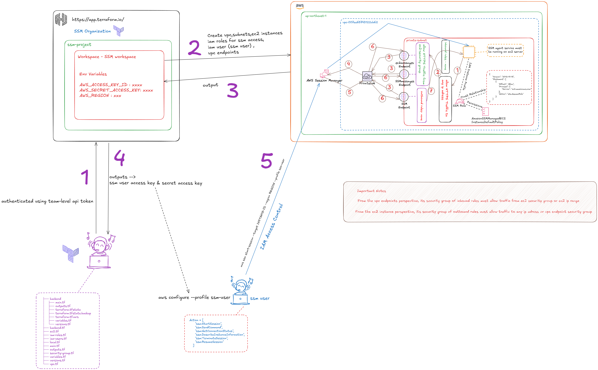

# Secure Private EC2 Access via Session Manager deployed by no clickOps(Terraform)

## Project Overview



### This project highlights 
- **Secure ec2 instances which is in private subnet accessed via system manager(No SSH and no inbound rules)**
- **No need to maintain long-lived credentials like SSH keys**
- **No need to provision bastion hosts to access to private ec2 instances**
- **Privately connected to AWS System Manager Service using AWS backbone network (private links) without exposing data to the internet**
- **Using Terraform Remote Backend to securly store state files and do secure state management**
- **The whole project infrastructure is automated and provisioned with no clickops(Terraform)**

## Used Technologies
1. ***Terraform (IAC)***
2. ***Terraform Cloud (Secure State Management)***
3. ***VPC (Logically isolated virtual network)***
4. ***AWS IAM (Identity and Access Management)***
5. ***AWS SSM (Secure Access Control)***
6. ***VPC Interface Endpoints (enables customers to privately connect to supported AWS services and VPC endpoint services powered by AWS PrivateLink)***

## Project Implementation Guidelines Step by Step

This project involves 2 parts to do implementation:
1. *Create Remote Backend in app.terraform.io for storing state files & state management using terraform*
2. *Create the whole AWS infrastructure for the project using terraform*

### Create Remote Backend in app.terraform.io for storing state files & state management using terraform


```bash
backend
├── main.tf 
├── outputs.tf
├── terraform.tfvars
├── variables.tf
└── versions.tf
```
1. Go to backend directory

2. Create `terraform.tfvars` vars files for storing variable values

3. `terraform init` 

4. `terraform fmt`

5. `terraform validate`

6. `terraform plan`

7. `terraform apply -auto-approve`

### Create the whole AWS infrastructure for the project using terraform

#### AWS Infrastructure Workflow Overview Diagram


```bash
secure-ssm-manager-access/
├── backend
│   ├── main.tf
│   ├── outputs.tf
│   ├── terraform.tfvars
│   ├── variables.tf
│   └── versions.tf
├── backend.tf
├── ec2.tf
├── iam-roles.tf
├── iam-users.tf
├── local.tf
├── main.tf
├── outputs.tf
├── README.md
├── security-group.tf
├── variables.tf
├── versions.tf
└── vpc.tf
```

1. Go to parent directory of the project
2. Modify and add your `backend config of hcp terraform` in backend.tf file

3. Do `terraform login` for authenticating to teraform cloud

4. Do `terraform init` for initializing hcp terraform backend and provider plugins

5. `terraform fmt`

6. `terraform validate`

5. `terraform plan` 

6. `terraform apply -auto-approve`

